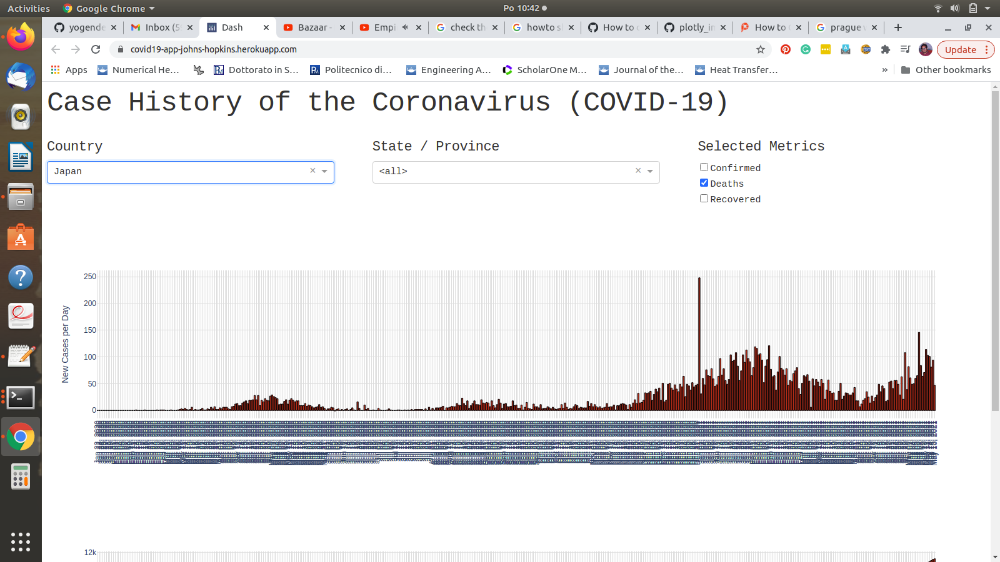
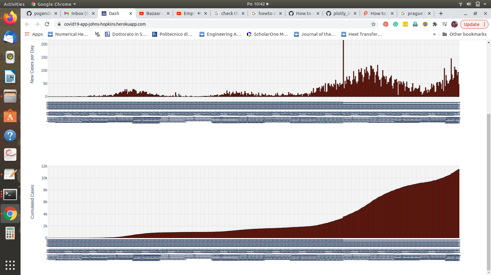

# covid19

#### About:
COVID 19 dataset fetch from John Hopkins Uni. deployed on heroku using FLASK/DASH. Covid struck the whole world, so I decided to contributed (atleat info wise).
What I represented in this work is purely educational/informational. I researched Johns Hopkins dataset in their public, open to use repository, pulled their repo, churend/squeezed/parsed/douged :blush: plotted thier data in a meaningful/ easy to grasp fashion using Dash/plottely/Flask. Datascience stacks I used are Pnadas/Numpy. A little bit sprinkle of HTML and CSS is also there. Finally deployed it on heroku.   

#### web app is available here [Heroku page ] (https://covid19-app-johns-hopkins.herokuapp.com/).

#### *This is how it looks like:*
#### You can choose country and deaths/recovered/confirmed from the drop down metrics. Its will parse date wise the COVID infection.

