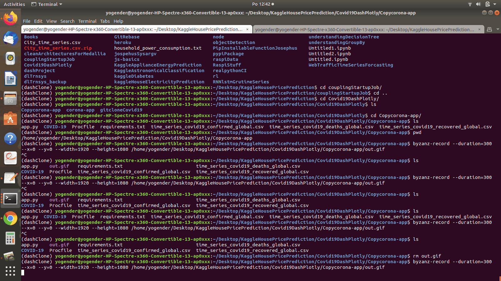

# covid19    

#### About:
COVID 19 dataset fetch from John Hopkins Uni. deployed on heroku using FLASK/DASH. Covid struck the whole world, so I decided to contribute (atleast info wise).
What I represented in this work is purely educational/informational. I researched Johns Hopkins dataset in their public, open to use repository, pulled their repo, churend/squeezed/parsed/douged :blush: plotted thier data in a meaningful/ easy to grasp fashion using Dash/plottely/Flask. Datascience stacks I used are Pnadas/Numpy. A little bit sprinkle of HTML and CSS is also there. Finally,   . The work is inspired by Meinhard Ploners git hub repo: https://github.com/ploner/coronavirus-py


#### web app is available here [Heroku page ] (https://covid19-app-johns-hopkins.herokuapp.com/).


#### *This is how it looks like:*
#### You can choose country and deaths/recovered/confirmed from the drop down metrics. Its will parse date wise the COVID infection.



###### Heroku for Sharing Public Dash apps for Free - these codes snippets can help:

###### * Step 1. Create a new folder for your project:

```
mkdir covid19
cd covid19
```
###### * Step 2. Initialize the folder with git and a conda environment:

```
git init
conda create --name myDashEnvironment
conda activate myDashEnvironment
```

###### * Step 3. Install dependencies

```
conda install -c conda-forge dash
conda install -c plotly plotly
conda install -c anaconda gunicorn

```
###### * Step 4. requirements.txt describes your Python dependencies. You can fill this file in automatically with:

```
pip freeze > requirements.txt
```

###### * Step 5. Initialize Heroku, add files to Git, and deploy

```
heroku create myDashApp
git add .
git commit -m 'Initial app'
git push heroku master # deploy code to heroku

```
###### * Step 6. Update the code and redeploy if fails

```
git status # view the changes
git add .  # add all the changes
git commit -m 'a description of the changes'
git push heroku master
```


*This is how screen shots of the application looks like:*


